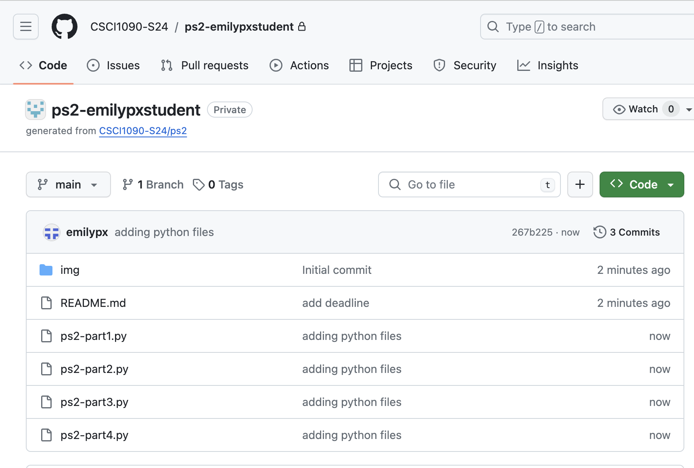
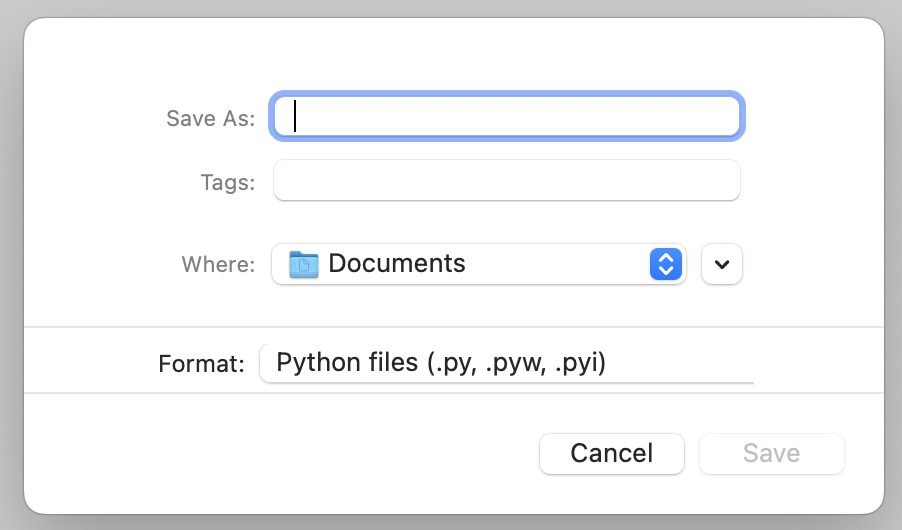
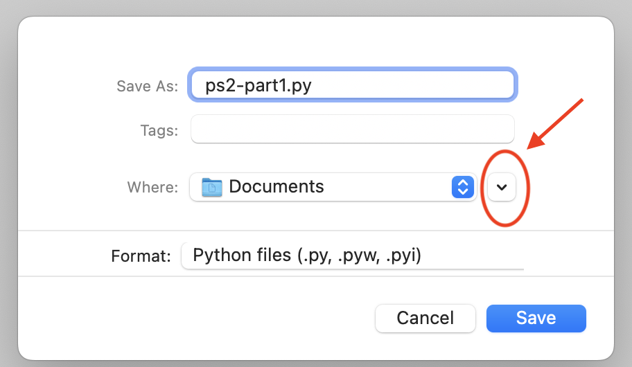
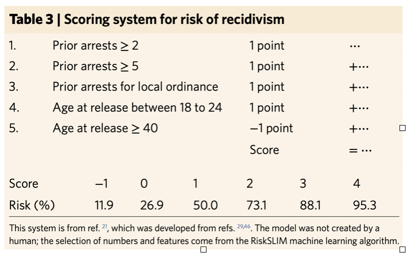

[](https://classroom.github.com/a/MXSOqTQ7)
# Problem Set 1
### Due Wednesday September 10, at 11:59pm EDT (Boston time)


### Accessing and submitting the problem set

As with PS0, you will be accessing and submitting this problem set using GitHub Classroom. As a reminder, here's how that goes:

1. Accept the invitation you found on Canvas in Problem Set 0 (which you have already done if you are here).

2. [Read PS0 Part 3 to review how to clone a problem set repository using GitHub Desktop and how to work on it locally.](https://github.com/finocchiaro-classes/csci-1090-f25-ps0/blob/main/README.md) **As described in PS0, you need to remember where you cloned your repo to on your own machine!**

3. Edit the files on your computer in this repository as described in the sections below.

4. [Read PS0 Part 8 to review how to submit your work using GitHub Desktop from your local machine up to GitHub on the internet.](https://github.com/finocchiaro-classes/csci-1090-f25-ps0/blob/main/README.md). Remember that you can commit and push your work as many times as you like. I recommend doing it often so that you have a backup of your work in case your computer breaks.

This respository is nearly empty. That's because you will be creating Python programs yourself, putting them (or creating them) in this directory, and pushing and committing them to GitHub.

**After you have committed and pushed all your work**, this is what  your repo will look like on GitHub in your browser (changing your name for my name, etc.):




### Deliverables

1. `ps1-part1.py` (Part 1)
2. `ps1-part2.py` (Part 2)
3. `ps1-part3.py` (Part 3)
4. `ps1-part4.py` (Part 4)

### Important Guidelines
* Your problem set must be submitted with GitHub. If you are struggling to use GitHub, the TAs and I can help!
* You can confirm that you submitted correctly by looking at your repo on GitHub in your browser. Log in at github.com, and select Repositories from the drop-down menu in the upper left corner.. 
* You do not need to do error checking. You can assume the user will always enter the kind of input you ask for.
* Comments are not required yet, but they are strongly encouraged so that we can give you partial credit.
* Points will be deducted if your output does not match the required format.
* Points will be deducted if your files are not named as required.
* Points will be deducted if your files are not in the correct location (i.e., in the top-level directory where you see the `README`.)

---

## Part 1: Math with user input

First, you are going to create a Python file in IDLE. Here's how to do that. You will be doing this for parts 2, 3, and 4, as well, so pay attention.

1. Launch IDLE.
2. Go to `File -> New file`. A new window will open.
3. Go to `File -> Save`. A dialog window will pop up where you can enter the name of the Python file and where you want to save it. This is what it looks like on a Mac. It will look similar on Windows.



5. Enter the file name `ps1-part1.py` in the `Save As` box.

6. Within the dialog box, you now have to navigate to wherever you decided to clone this PS1 repository.  If you're on a Mac and it's giving you limited options where to save your file, click the little arrow circled in the screenshot below. That will give you a real Finder-type window where you can navigate to wherever you saved the repo.



**Recall that I suggest cloning all your GitHub problem set repos to a folder called `DataScience` or `CSCI1090` on your Desktop or in your Documents folder. You can go look in GitHub Desktop to where you actually cloned this repository.**

6. Now you have a Python program you can edit! This is what you should make your program do.

* Ask the user for an integer between 10 and 100. Save that to a variable called `firstnum`.
* Ask the user for a second integer that is less than 4. Save that to a variable called `secondnum`.
* Repeat back to the user the two numbers that they entered.
* Print out their sum.
* Print out their product.
* Print out the first number raised to the power of the second number.
* Print out the remainder you get when you divide the first number by the second number.

**IMPORTANT: Save your file and test it after each line of code that you write. When you get an error message, it will be easier to determine exactly when and where you introduced an error if you are only testing a small amount of new code.** 

7. When you run your program (`Run -> Run module`), your output must look like the example below. We wil take off points if the words, capitalization, new lines, etc., are not the same as the output below. The only thing that will vary will be the input provided by the user or the result of a mathematical operation. You don't need to use anything fancy in `print()` like fstrings or the `+` operator.


```
Enter an integer between 10 and 100: 24
Enter an integer less than 4: 3
You entered 24 and 3
24 + 3 = 27
24 * 3 = 72
24 ** 3 = 13824
24 % 3 = 0
```


## Part 2: Math with user input using a function

Create a new file called `ps1-part2.py` just as you did above. This program will do what you did in Part 1, but this time you will write your own function to do the math work. Here's how it will go:

1. Write a function called `number_fun()` that takes two integer parameters, `a` and `b`. The function should everything you did above except get the input from the user, namely:
* Repeat back to the user the two integers that they entered.
* Print out their sum.
* Print out their product.
* Print out the first number raised to the power of the second number.
* Print out the remainder you get when you divide the first number by the second number.

2. **Outside** (after) the function definition, type code to:

* Ask the user for an integer between 10 and 100. Save that to a variable called `firstnum`.
* Ask the user for a second integer that is less than 4. Save that to a variable called `secondnum`.
* Call the `number_fun()` function, passing in `firstnum` and `secondnum` as the arguments.

When you run your program, your output should look exactly like the output of your program in Part 1.

## Part 3: Target heart rate calculator
In this problem, you will ask a user to provide their age and to choose between two fitness goals. You will then tell them what their target heart rate should be for that fitness goal given their age. Your code will go in a file called `ps1-part3.py`, which you will create as you did for the other problems, above. Here's how your code should work:

1. Write a function, `heart_rate()` that takes two parameters: `age` (an integer) and `goal` (a character, `S` for speed or `E` for endurance). The function should do the following:
* Subtract the user's age from 220 to give their max heart rate, saved as a variable called `max_HR`.
* Print out the user's max heart rate.
* Print out their target heart rate range given their goal.
  - If the `goal` value is `S`, their target heart rate range is 80\% to 100\% of `max_HR`.
  - If the `goal` value is `E`, their target heart rate range is 60\% to 80\% of `max_HR`.
* See the example output below for the exact wording of your output and a few examples.

2. **Outside** (after) the function definition, type code to
* Ask the user their age, which you should save as a variable called `user_age`. See the example output below for the required wording.
* Ask the user if they want to improve speed (`S`) or endurance (`E`). Save the input as `user_goal`. See the example output below for the required wording.
* Call the `heart_rate()` function you wrote above, passing in `user_age` and `user_goal` as the arguments.

When you run your program (`Run -> Run module`), your output must look like the two example outputs below. We wil take off points if the words, capitlization, new lines, etc., are not the same as the output below. The only thing that will vary will be the information provided by the user and the result of the mathematical operations.

Example 1:

```
What is your age? 40
Is your goal speed (S) or endurance (E)? E
Your maximum heart rate is: 180
Your target heart rate is between 108.0 and 144.0
```

Example 2:

```
What is your age? 40
Is your goal speed (S) or endurance (E)? S
Your maximum heart rate is: 180
Your target heart rate is between 144.0 and 180
```


## Part 4: Recidivism calculator
Recidivism risk scores are used to assess the risk of committing another crime after arrest and are used in bail and early parole decisions.  In Cynthia Rudin’s article [Stop explaining black box machine learning models for high stakes decisions and use interpretable models instead](https://www.nature.com/articles/s42256-019-0048-x) (Nature Machine Intelligence, 2019), Rudin shows how the following simple model is almost as accurate as more complex machine learning models.



Following the structure you used for Part 1 (i.e., no need for a separate function), write a Python program called `ps1-part4.py` that calculates recidivism risk based on this simple model. Ask the user for (1) the number of prior arrests; (2) whether there are prior arrests for a local ordinance; and (3) the individual's age at release.

Here's are a few sample runs of the program. **Remember that your output must match this output in terms of words, formatting, etc.**

Example 1:

```
Prior arrests: 3
Prior arrests for local ordinance (Y/N): Y
Age at release: 23
The recidivism risk score is 3
```

Example 2:

```
Prior arrests: 1
Prior arrests for local ordinance (Y/N): N
Age at release: 41
The recidivism risk score is -1
```

---

## Deadline: Wednesday, September 10, 2025, at 11:59pm EDT (Boston time)

## Deliverables

1. `ps1-part1.py` (Part 1)
2. `ps1-part2.py` (Part 2)
3. `ps1-part3.py` (Part 3)
4. `ps1-part4.py` (Part 4)

## Reminder: Important Guidelines
* Your problem set must be submitted with GitHub. If you are struggling to use GitHub, the TAs or I can help during office hours.
* You do not need to do error checking of user input. You can assume the user will always enter the kind of iput you ask for.
* Comments are not required yet, but they are strongly encouraged.
* Points will be deducted if your output does not match the requires format.
* Points will be deducted if your files are not named as required.
* Points will be deducted if your files are not in the correct location (i.e., in the top-level directory where you see the `README`.)
